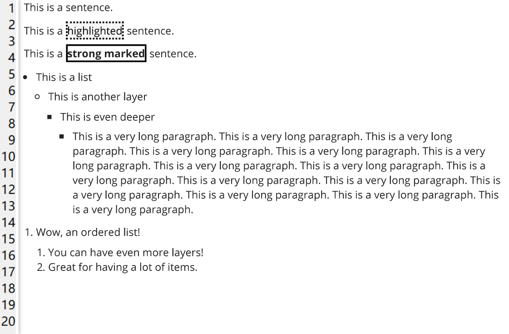

# GitHub Print - A Typora Theme Optimized for Printing

This theme is based on the `GitHub` theme bundled with Typora, with some modification to optimize for printing scenarios.


## Usage

Put the `github_print.css` into Typora's theme folder. (Settings - Appearance  - Theme - Open Theme Folder). Then restart Typora and choose the `Github Print` Theme for printing.


## Modifications

The main modification are as follows:

1. Smaller Line Height: for a more compact printing layout

   ```css
   body {
       line-height: 1.4; /* original value: 1.6 */
   }
   ```
   
2. Shorter indentation for lists: less wasted blank space, while still keeping the hierarchy easily recognizable

   ```css
   ul,
   ol {
       padding-left: 15px;  /* original value: 30 */
   }
   ```

3. Using borders for `**strong**` and `==highlighted==` markings: more contrast when printing in Black/White mode

   ```css
   mark { /* highlight */
       border: dotted black 2px;
   }
   
   strong { /* strong */
       border: solid black 2px;
   }
   ```

   

## Screenshots

All the example files can be found in the `example` folder.

All the screenshots have the same width & height, and all the PDF files are using the same zoom ratio. 

| `Github`                                                     | `Github Print`                                               |
| ------------------------------------------------------------ | ------------------------------------------------------------ |
|  |  |

Black/White simulated using Adobe Acrobat Reader, which prints to Microsoft Print-to-PDF printer with Black/White mode checked.

| `Github` in Black/White                                      | `Github Print` In Black/White                                |
| ------------------------------------------------------------ | ------------------------------------------------------------ |
|  |  |


